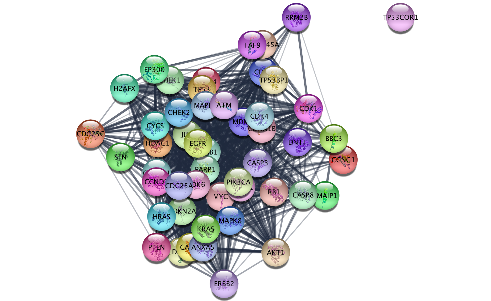

## ___checkCytoscapeVersion___

Checks cytoscape version.

* **`host`** cytoscape host address, default=cytoscape_host
* **`port`** cytoscape port, defaul=cytoscape_port
* **`returns`** nothing

```python
>>> import AGEpy as age
>>> age.checkCytoscapeVersion()

cytoscapeVersion 3.6.0
apiVersion v1
```
___
## ___cytoscape___

General function for interacting with Cytoscape API.

* **`namespace`** namespace where the request should be executed. eg. "string"
* **`commnand`** command to execute. eg. "protein query"
* **`PARAMs`** a dictionary with the parameters. Check your swagger normaly running on
http://localhost:1234/v1/swaggerUI/swagger-ui/index.html?url=http://localhost:1234/v1/commands/swagger.json
* **`host`** cytoscape host address, default=cytoscape_host
* **`port`** cytoscape port, default=cytoscape_port
* **`method`** type of http call, ie. "POST" or "GET" or "HELP".
* **`verbose`** print more information
* **`returns`** For "POST" the data in the content's response. For "GET" None.

```python
>>> import AGEpy as age
>>> response=age.cytoscape("string","pubmed query",{"pubmed":"p53 p21","limit":"50"})
>>> print response

{u'SUID': 37560}
```
___
## ___result___

Displays the current network.

* **`filetype`** file type, default="PNG"
* **`saveas`** /path/to/non/tmp/file.prefix
* **`host`** cytoscape host address, default=cytoscape_host
* **`port`** cytoscape port, default=cytoscape_port
* **`returns`** an image

```python
>>> import AGEpy as age
>>> response=age.result()
>>> response
```

___

## ___getTableColumns___

Gets tables from cytoscape.

* **`table`** table to retrieve eg. node
* **`columns`** columns to retrieve in list format
* **`namespace`** namepsace, default="default"
* **`network`** a network name or id, default="current"
* **`host`** cytoscape host address, default=cytoscape_host
* **`port`** cytoscape port, default=cytoscape_port
* **`verbose`** print more information
* **`returns`** a pandas dataframe

```python
>>> import AGEpy as age
>>> response=age.getTableColumns('node',['display name'])
>>> print response

                     display name
9606.ENSP00000367207          MYC
9606.ENSP00000356150         MDM4
9606.ENSP00000228872       CDKN1B
9606.ENSP00000361021         PTEN
9606.ENSP00000265734         CDK6
```
___
