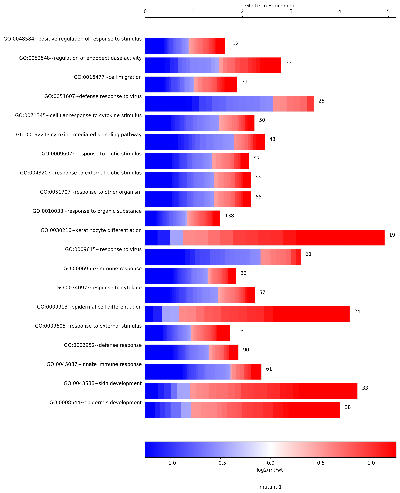
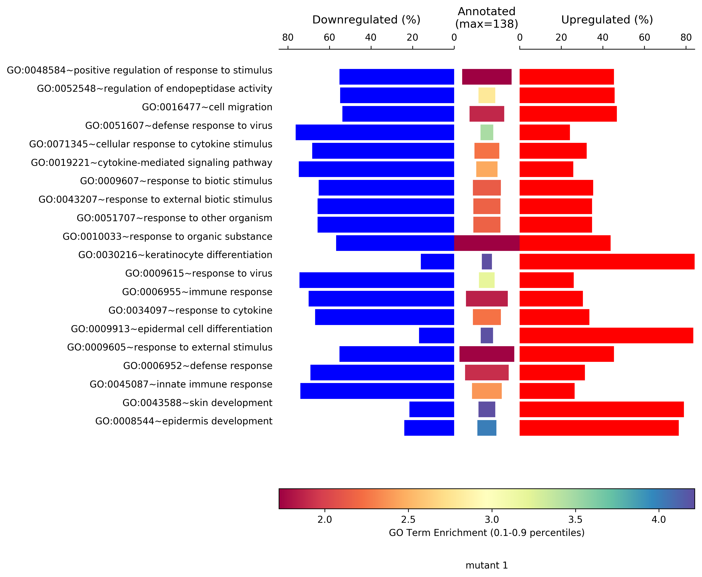
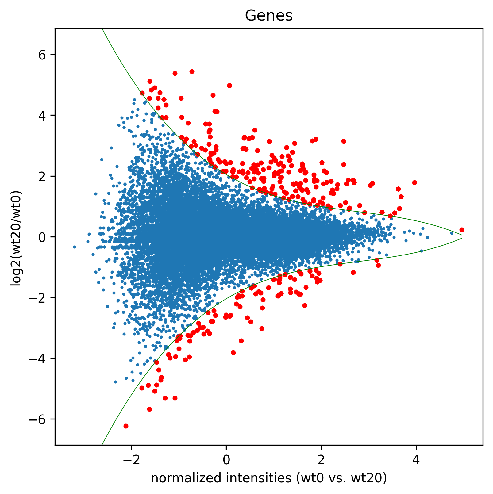
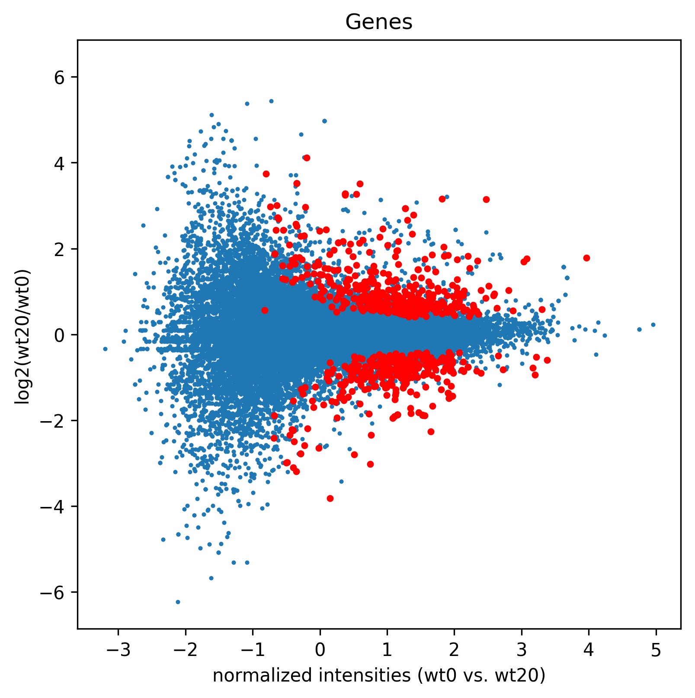
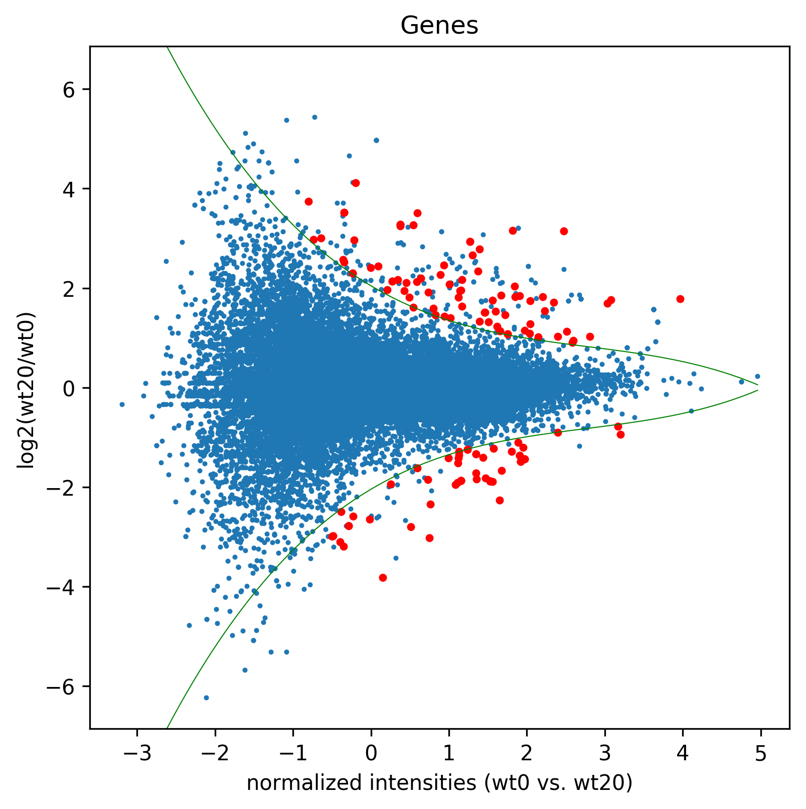

## ___CellPlot___

Python implementation of the CellPlot from the CellPlot package for R.
-inf or inf enrichments will come out as min found float or max found float, respectively.

**`CellPlot(df, output_file=None, term_col="termName", gene_expression_col='log2fc', gene_expression="log2FC",x_values="-log10(p)", xaxis_label = "-log10(p)", pvalCol="ease", figure_title="CellPlot", lowerLimit=None, upperLimit=None, colorBarType='coolwarm'):`**

* **`df`** pandas dataframe with the following columns - 'Enrichment', 'Term', and 'log2fc'.
           For log2fc each cell must contain a comma separated string with the log2fc for the genes enriched in the respective term.
           eg. '-inf,-1,2,3.4,3.66,inf'
* **`output_file`** prefix for an output file. If given it will create output_file.CellPlot.svg and output_file.CellPlot.png
* **`gene_expression_col`** column with gene expression data separated by a comma (ie. ',')
* **`gene_expression`** label for the color gradiant bar.
* **`x_values`** values to use on the x-axis
* **`xaxis_label`** label for x-axis
* **`figure_title`** Figure title.
* **`term_col`** the column with the terms names
* **`pvalCol`** name of the column containing the p values to determine if the terms should be marked as NS - not significant, use None for no marking
* **`lowerLimit`** lower limit for the heatmap bar (default is the 0.1 percentile)
* **`upperLimit`** upper limit for the heatmap bar (default is the 0.9 percentile)
* **`colorBarType`** type of heatmap, 'Spectral' is default, alternative eg. 'seismic'
* **`returns`** a matplotlib figure

```python
>>> import AGEpy as age
>>> print df.head()

    categoryName                                           termName  listHits  \
0  GOTERM_BP_FAT                          GO:0006396~RNA processing       716   
1  GOTERM_BP_FAT  GO:0043933~macromolecular complex subunit orga...      1433   
2  GOTERM_BP_FAT                  GO:0016071~mRNA metabolic process       523   
3  GOTERM_BP_FAT           GO:0044085~cellular component biogenesis      1596   
4  GOTERM_BP_FAT    GO:0022613~ribonucleoprotein complex biogenesis       398   

     percent           ease  \
0  10.599556  8.904648e-157   
1  21.213916  2.144221e-124   
2   7.742413  1.473027e-109   
3  23.626943  2.398988e-108   
4   5.891932   7.142953e-99   

                                             geneIds  listTotals  popHits  \
0  ENSG00000151304, ENSG00000091127, ENSG00000171...        6085      910   
1  ENSG00000166337, ENSG00000110075, ENSG00000110...        6085     2461   
2  ENSG00000138385, ENSG00000106355, ENSG00000110...        6085      672   
3  ENSG00000110075, ENSG00000110074, ENSG00000164...        6085     2914   
4  ENSG00000151304, ENSG00000215301, ENSG00000171...        6085      480   

   popTotals  foldEnrichment     bonferroni      benjamini           afdr  \
0      16650        2.152907  1.021719e-152  1.021719e-152  1.842717e-153   
1      16650        1.593266  2.460279e-120  1.230140e-120  4.437224e-121   
2      16650        2.129541  1.690151e-105  5.633836e-106  3.048263e-106   
3      16650        1.498639  2.752599e-104  6.881498e-105  4.964436e-105   
4      16650        2.268796   8.195824e-95   1.639165e-95   1.478154e-95   

                                          genes name  \
0  SRFBP1, PUS7, CHD7, SSB, LSM5, NOB1, GTF2H1, A...   
1  TAF10, PPP6R3, FOXRED1, PSMC1, ILK, EP400, CTB...   
2  SSB, LSM5, GTF2H1, ALYREF, RPS10, SNRNP35, CNO...   
3  PPP6R3, FOXRED1, UTP15, SIX1, LLGL1, RPL9, TRI...   
4  SRFBP1, DDX3X, CHD7, NOB1, RPS10, UTP15, RPL30...   

                                              log2fc   -log10(p)  
0  0.153, 0.37, 0.023, 0.321, 0.084, 0.61, 0.118,...  156.050383  
1  -0.309, 0.078, -0.063, 0.005, 0.054, -0.051, 0...  123.668730  
2  0.321, 0.084, 0.118, -0.013, 0.06, -0.055, 0.0...  108.831789  
3  0.078, -0.063, -0.303, -0.39, -0.254, 0.092, -...  107.619972  
4  0.153, 0.221, 0.023, 0.61, 0.06, -0.303, 0.15,...   98.146122  

>>> cellplot=age.CellPlot(df[:20])
```

___

## ___SymPlot___

Python implementation of the SymPlot from the CellPlot package for R.
-inf or inf enrichments will come out as min found float or max found float, respectively.

**`SymPlot(df,output_file=None,figure_title="SymPlot", pvalCol="ease", term_col="termName", x_values="-log10(p)", n_terms_col="listHits", gene_expression_col="log2fc" , xaxis_label = "-log10(p)", colorBarType='coolwarm')`**

* **`df`** pandas dataframe with the following columns - 'Enrichment', 'Significant', 'Annotated', 'Term', and 'log2fc'. 'Annotated'i stands for number of genes annotated with the respective GO term. As reported in DAVID by listHits. For log2fc each cell must contain a comma separated string with the log2fc for the genes enriched in the respective term. eg. '-inf,-1,2,3.4,3.66,inf'
* **`gene_expression_col`** column with gene expression data separated by a comma (ie. ',')
* **`gene_expression`** label for the color gradiant bar.
* **`x_values`** values to use on the x-axis
* **`xaxis_label`** label for x-axis
* **`term_col`** the column with the terms names  
* **`output_file`** prefix for an output file. If given it witll create output_file.SymPlot.svg and output_file.SymPlot.png
* **`figure_title`** Figure title.
* **`pvalCol`** name of the column containing the p values to determine if the terms should be marked as NS - not significant, use None for no marking
* **`colorBarType`** type of heatmap, 'coolwarm' is dafault, alternative eg. 'seismic','Spectral','bwr','coolwarm'
* **`returns`** a matplotlib figure

```python
>>> import AGEpy as age
>>> symplot=age.SymPlot(df[:20],"symplot", "mutant 1",pvalCol="ease")
```

___
## ___MA___

Plots an MA like plot.

**`MA(df, title, figName, c, daType="counts", nbins=10, perc=.5, deg=3, eq=True, splines=True, spec=None, Targets=None, ylim=None, sizeRed=8)`**

* **`df`** dataframe output of GetData()
* **`title`** plot title, 'Genes' or 'Transcripts'
* **`figName`** /path/to/saved/figure/prefix
* **`c`** pair of samples to be plotted in list format
* **`daType`** data type, ie. 'counts' or 'FPKM'
* **`nbins`** number of bins on normalized intensities to fit the splines
* **`per`** log2(fold change) percentil to which the splines will be fitted
* **`deg`** degress of freedom used to fit the splines
* **`eq`** if true assumes for each bin that the lower and upper values are equally distant to 0, taking the smaller distance for both
* **`splines`** plot splines, default=True
* **`spec`** list of ids to be highlighted
* **`Targets`** list of ids that will be highlighted if outside of the fitted splines
* **`ylim`** a list of limits to apply on the y-axis of the plot
* **`sizeRed`** size of the highlight marker
* **`returns df_`** a Pandas dataframe similar to the GetData() output with normalized intensities and spline outbounds rows marked as 1.
* **`returns red`** list of ids that are highlighted

```python
>>> import AGEpy as age
>>> print df.head()

gene_id                    gene  wt0  wt20  log2(wt20/wt0)  \
0  ENSG00000223972                 DDX11L1  0.0   0.0             NaN   
1  ENSG00000243485  MIR1302-2,RP11-34P13.3  0.0   0.0             NaN   
2  ENSG00000274890  MIR1302-2,RP11-34P13.3  0.0   0.0             NaN   
3  ENSG00000268020                  OR4G4P  0.0   0.0             NaN   
4  ENSG00000240361                 OR4G11P  0.0   0.0             NaN   

p_value  q_value significant  
0      1.0      1.0          no  
1      1.0      1.0          no  
2      1.0      1.0          no  
3      1.0      1.0          no  
4      1.0      1.0          no  

>>> madf1,sig1=age.MA(dge_, 'Genes',"MA1",["wt0","wt20"], daType="FPKM")
```

```python
>>> sigGenes=df[df["significant"=="yes"]]["gene_id"].tolist()
>>> madf2,sig2=age.MA(dge_, 'Genes',"MA2", ["wt0","wt20"], splines=False, daType="FPKM",spec=sigGenes)
```

```python
>>> madf3,sig3=age.MA(dge_, 'Genes',"MA3", ["wt0","wt20"], splines=True, daType="FPKM",Targets=sigGenes)
```

___
